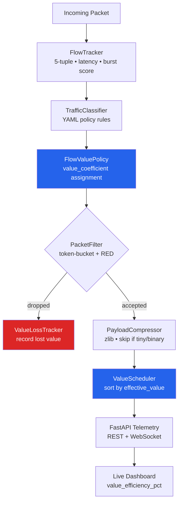

# BandwidthOS — Network Value Optimizer

> **This is not a bandwidth optimizer.  It is a business-value routing engine
> that happens to speak TCP/IP.**

Every packet on your network has a different *business cost* if it is dropped
or delayed.  A dropped VoIP frame creates an audible glitch in a $50 k/yr
enterprise call.  A delayed bulk update loses nothing.  BandwidthOS makes your
network scheduler understand that difference — and act on it.

```
Traditional QoS:  "This packet is HIGH priority."
BandwidthOS PVM:  "This packet is worth 100× more than that one."
```

Built for **routers**, **local servers**, and **ISP edge nodes**.  Pure Python.
No kernel modules.  Production-grade (448 tests, multi-threaded, async API).

---

## What it actually does

| Layer | What BandwidthOS adds |
|---|---|
| **Traffic Classification** | Rule-based priority from YAML — VoIP → CRITICAL, BitTorrent → BACKGROUND |
| **Packet Value Model (PVM)** | Continuous value coefficients replace discrete tiers — schedule by *business impact*, not just class |
| **Value Calibration** | Industry-standard presets (VoIP=100, API=50, bulk=0.5) so you don't guess |
| **Compression** | zlib payload compression on every packet — saves bandwidth automatically |
| **Token-bucket + RED** | Rate-limiting and Random Early Detection drop the *least valuable* packets under load |
| **Flow Intelligence** | 5-tuple tracking with latency/burst scoring — auto-promotes VoIP, auto-demotes bulk |
| **SLA Contracts** | Per-tenant *minimum value-rate* guarantees — breach detection in real time |
| **Feedback Loop** | Heuristic auto-tuner: raises coefficient when SLA is breached, decays when perfect |
| **Multi-node Coordination** | Fleet-wide value efficiency view across all nodes — find your worst node in one API call |
| **Real-time Telemetry** | FastAPI + WebSocket dashboard — live `value_efficiency_pct` and `value_lost_per_sec` |

---

## Architecture



### Pipeline stages

| Stage | Module | What it does |
|---|---|---|
| **0 – Flow Tracking** | `flow_tracker.py` | Builds per-5-tuple records; computes latency, bandwidth, burst scores |
| **1 – Classification** | `classifier.py` + `policy.py` | Assigns `TrafficPriority`; loads rules from YAML |
| **1b – Value Assignment** | `value.py` / `FlowValuePolicy` | Assigns `value_coefficient` from presets or YAML rules |
| **2 – Filtering** | `packet_filter.py` | Token-bucket rate limiting; RED probabilistic drops |
| **3 – Compression** | `compressor.py` | zlib compress if payload > threshold and compressible |
| **4 – Scheduling** | `value.py` / `ValueScheduler` | Priority heap sorted by `value_coefficient × priority_multiplier` |
| **Telemetry** | `api/server.py` | FastAPI REST + WebSocket push; built-in HTML dashboard |

---

## Killer Demo — VoIP Call vs. Bulk Update Storm

> **The scenario:** A software update is saturating a 1 MB/s link.
> The queue is full of bulk packets (BitTorrent port 6881).
> A VoIP call arrives.  What happens?

**Without PVM**: the VoIP packet joins the back of the queue behind all the
bulk traffic.  Audio glitches.  SLA breached.

**With BandwidthOS PVM**: VoIP (coeff=100) evicts the lowest-value bulk packet
(coeff=0.5) and is forwarded *first*, in under one scheduler cycle.

```
$ python demos/01_killer_demo.py
```

```
──────────────────────────────────────────────────────────────
  KILLER DEMO — Value-Aware Network Under Congestion
──────────────────────────────────────────────────────────────

  Scenario: A bulk software update (6881/tcp) saturates a 1 MB/s
  link with 5-packet queue depth.  A VoIP call arrives mid-storm.

  Phase 1 – Bulk update fills the queue

    [QUEUED ]  bulk[0]  coeff= 0.5  10.0.0.0:50000 → :6881
    [QUEUED ]  bulk[1]  coeff= 0.5  10.0.0.1:50001 → :6881
    [QUEUED ]  bulk[2]  coeff= 0.5  10.0.0.2:50002 → :6881
    [QUEUED ]  bulk[3]  coeff= 0.5  10.0.0.3:50003 → :6881
    [QUEUED ]  bulk[4]  coeff= 0.5  10.0.0.4:50004 → :6881

    Queue depth: 5/5  (full)

  Phase 2 – VoIP call arrives (RTP, port 5004)

    [QUEUED ]  voip   coeff=100.0  192.168.1.10:5004 → :5004  ← evicted 1 bulk packet!

  Phase 3 – Scheduler drains: who transmits first?

    1.  [VoIP]  coeff=100.0  192.168.1.10:5004 → :5004  ← FIRST!
    2.  [bulk]  coeff=  0.5  10.0.0.1:50001 → :6881
    3.  [bulk]  coeff=  0.5  10.0.0.2:50002 → :6881
    4.  [bulk]  coeff=  0.5  10.0.0.3:50003 → :6881
    5.  [bulk]  coeff=  0.5  10.0.0.4:50004 → :6881

  Value Metrics
    Value delivered : 102.5 units
    Value lost      : 0.0 units
    Efficiency      : 100.0%

  Result: VoIP call quality protected. Bulk update uses leftover.
──────────────────────────────────────────────────────────────
```

**The magic**: `ValueScheduler` uses a heap sorted by
`effective_value = value_coefficient × priority_multiplier`.  When the queue
overflows, it evicts the packet with the *lowest* effective value — always.
VoIP at 100× always beats bulk at 0.5×.

---

## Quick Start

```bash
# 1. Install
pip install -e .
pip install fastapi uvicorn[standard] pyyaml   # for the server

# 2. Run the built-in demo
python main.py demo

# 3. Run the killer PVM demo
python demos/01_killer_demo.py

# 4. Start the live dashboard (http://localhost:8000/)
python main.py serve
```

### With the Packet Value Model (3 lines)

```python
from bandwidth_optimizer.value import FlowValuePolicy
from bandwidth_optimizer import BandwidthOptimizer

# Industry-standard presets — no YAML needed
optimizer = BandwidthOptimizer(
    flow_value_policy=FlowValuePolicy.from_presets()
)

result = optimizer.process(packet)
print(optimizer.stats()["value"]["value_efficiency_pct"])  # e.g. 97.3
```

### With a YAML policy file

```yaml
# my_policy.yaml
version: "1"
defaults:
  priority: MEDIUM
rules:
  - name: enterprise_voip
    description: "Enterprise VoIP — worth 100× default traffic"
    match:
      ports: [5060, 5061, 5004, 5005]
      protocols: [udp, tcp]
    priority: CRITICAL
    value_coefficient: 100.0   # ← PVM key

  - name: revenue_api
    match:
      ports: [443, 8443]
      protocols: [tcp]
    priority: HIGH
    value_coefficient: 50.0

  - name: bulk_backup
    match:
      ports: [6881]
      protocols: [tcp, udp]
    priority: BACKGROUND
    value_coefficient: 0.5     # yields to everything
```

```bash
python main.py --license-key <KEY> --policy my_policy.yaml serve
```

---

## Value Calibration — Industry-Standard Presets

> **The #1 barrier to PVM adoption**: "What number do I put in `value_coefficient`?"

`ValueCoefficientsGuide` answers that with research-backed defaults:

```
$ python demos/02_value_calibration.py
```

```
────────────────────────────────────────────────────────────────────
  VALUE CALIBRATION — Industry-Standard Presets
────────────────────────────────────────────────────────────────────

  Built-in presets (ValueCoefficientsGuide):

  Name                   Coeff  Priority    Rationale (abbreviated)
  -------------------- -------  ----------  -----------------------------------
  voip                   100.0  CRITICAL    Each dropped RTP packet causes an audible glitch...
  interactive_api         50.0  HIGH        Sub-100 ms latency is a hard requirement for checkout...
  video_conference        40.0  HIGH        Video can absorb ~200 ms jitter via playout buffer...
  interactive_web         20.0  HIGH        100 ms of extra latency has measurable revenue impact...
  email                    5.0  MEDIUM      A few seconds of extra latency is imperceptible...
  bulk_transfer            0.5  BACKGROUND  Should use only leftover capacity. Coefficient < 1...

  Per-packet coefficient lookup:

  VoIP SIP signalling            port= 5060/udp  coeff= 100.0  ████████████████████
  VoIP RTP audio                 port= 5004/udp  coeff= 100.0  ████████████████████
  HTTPS API call                 port=  443/tcp  coeff=  50.0  ██████████
  Video conferencing             port= 8801/udp  coeff=  40.0  ████████
  HTTP web browsing              port=   80/tcp  coeff=  20.0  ████
  DNS query                      port=   53/udp  coeff=  20.0  ████
  Email SMTP                     port=   25/tcp  coeff=   5.0  █
  BitTorrent (bulk)              port= 6881/tcp  coeff=   0.5
  Unknown traffic (default)      port= 9999/tcp  coeff=   1.0
```

### Calibrate to your revenue model

```python
# $1k/hr SLA exposure → scale everything by 10
vp = FlowValuePolicy.from_presets(revenue_scale=10.0)
# VoIP: 1000.0 | API: 500.0 | bulk: 5.0

# Override one preset
vp = FlowValuePolicy.from_presets(overrides={"voip": 200.0, "bulk_transfer": 0.1})
```

### Preset rationale

| Preset | Coefficient | Business rationale |
|---|---|---|
| `voip` | **100** | Dropped RTP frame = audible glitch. Immediate SLA credit liability. |
| `interactive_api` | **50** | 100 ms API latency = checkout abandonment, trading slippage |
| `video_conference` | **40** | ~200 ms jitter buffer before visible artefacts appear |
| `interactive_web` | **20** | 100 ms latency ≈ 1% sales drop (Amazon research) |
| `email` | **5** | Seconds of delay imperceptible to users; needs a floor |
| `bulk_transfer` | **0.5** | Yields to all other traffic including unclassified flows |

---

## Feedback Loop — Auto-Tuning Without ML

> **The problem**: static coefficients are best-guesses.  Network conditions
> change.  An SLA breach means your coefficient isn't high enough *right now*.

`ValueCoefficientTuner` closes the loop automatically using pure heuristics:

```
$ python demos/03_feedback_loop.py
```

```
────────────────────────────────────────────────────────────────────
  FEEDBACK LOOP — Auto-Tuning Value Coefficients
────────────────────────────────────────────────────────────────────

  Rule:    voip (SIP/RTP port 5060)
  SLA:     min 100 value-units/s
  Start:   coefficient = 100.0

  Obs   Delivered    Eff%  Action                  Coefficient
  ---  ----------  ------  ----------------------  -----------
    1        48.0   48.0%!  SLA violated — burst storm   120.0000
    2        55.0   55.0%!  SLA violated — still under   144.0000
    3        72.0   72.0%!  SLA violated — improving   172.8000
    4        91.0   91.0%   Acceptable   — no change   172.8000
    5        95.0   95.0%   Acceptable   — no change   172.8000
    6       100.5  100.5%   SLA met      — no change   164.1600
    7        99.9   99.9%   Perfect      — decay x0.95   155.9520
    8        99.9   99.9%   Perfect      — decay x0.95   148.1544
   ...
   11        88.0   88.0%!  SLA violated — boost again   168.8960
   ...
   15        99.9   99.9%   Perfect      — decay x0.95   137.5669

  Summary
    Base coefficient:    100.0000
    Final coefficient:   137.5669
    Total boosts:        4
    Total decays:        8
```

### Algorithm (3 rules, no ML)

```
if efficiency < 90%:    coefficient x 1.2   (boost — scheduler defends this flow)
if efficiency > 99.5%:  coefficient x 0.95  (decay — free up headroom for others)
else:                   no change            (in the acceptable zone)
```

### Integration

```python
from bandwidth_optimizer.value import FlowValuePolicy, ValueCoefficientTuner
from bandwidth_optimizer import ValueSLAContract

policy    = FlowValuePolicy.from_presets()
tuner     = ValueCoefficientTuner(policy)
sla       = ValueSLAContract("voip_tenant", min_value_rate_per_sec=100.0)
optimizer = BandwidthOptimizer(flow_value_policy=policy)

# Call every 5 seconds from your monitoring loop
tuner.observe_contract(
    "voip",
    delivered_rate=optimizer.value_tracker.value_delivered_per_sec,
    contract=sla,
)

print(tuner.tuning_report())
```

---

## Multi-Node Fleet Coordination

> **The problem**: each node optimizes locally.  You have no fleet-wide view.
> Which node is haemorrhaging value?  Where should you route high-value flows?

`AgentCoordinator.fleet_value_summary()` aggregates PVM metrics from all nodes:

```
$ python demos/04_fleet_coordination.py
```

```
──────────────────────────────────────────────────────────────
  FLEET COORDINATION — Global Value View Across Nodes
──────────────────────────────────────────────────────────────

  Ingesting heartbeats from 4 nodes (3 PVM + 1 legacy)...

    v  edge-us-east     PVM  eff=98.2%
    v  edge-eu-west     PVM  eff=74.1%
    v  edge-ap-south    PVM  eff=91.5%
    v  legacy-dc-01     legacy (no PVM)

  Fleet value summary (GET /agents/value):

{
    "fleet_value_efficiency_pct": 91.3,
    "fleet_value_delivered_per_sec": 8493.0,
    "fleet_value_lost_per_sec": 809.0,
    "best_node": "edge-us-east",
    "worst_node": "edge-eu-west",
    "pvm_node_count": 3,
    "non_pvm_nodes": ["legacy-dc-01"],
    "nodes": {
        "edge-us-east":  {"value_efficiency_pct": 98.2, ...},
        "edge-eu-west":  {"value_efficiency_pct": 74.1, ...},
        "edge-ap-south": {"value_efficiency_pct": 91.5, ...}
    }
}

  Action: Route new high-value flows toward edge-us-east.
  Trigger a deeper investigation on edge-eu-west (74.1% eff).
──────────────────────────────────────────────────────────────
```

### Start a coordinated cluster

```bash
# Node 1 — run with coordinator
python main.py --license-key <KEY> --policy my_policy.yaml serve --coordinator

# Agents POST heartbeats to the coordinator
curl -X POST http://coordinator:8000/agent/edge-eu-west/stats \
     -H 'Content-Type: application/json' \
     -d '{"packets_received": 32000, "value": {"value_efficiency_pct": 74.1, ...}}'

# Check fleet value health
curl http://coordinator:8000/agents/value
```

---

## CLI Reference

```bash
# One-shot demo
python main.py demo

# Continuous simulation (Ctrl-C to stop)
python main.py simulate

# Live dashboard + API
python main.py serve --host 0.0.0.0 --port 8000

# Multi-node coordinator
python main.py serve --coordinator --secret my-shared-hmac-secret

# Performance benchmark
python main.py bench --packets 10000

# Adversarial stress test
python main.py stress --duration 10 --pps 10000 --pattern burst_flood

# JSON stats snapshot
python main.py stats
```

#### Benchmark output

```
$ python main.py bench --packets 5000

==============================================================
  Smart Bandwidth Optimizer – Benchmark Results
==============================================================
  Packets processed : 5,000
  Duration          : 1.238 s
  Throughput        : 4,040 pkt/s

  End-to-end latency (us):
    min=66.9  mean=524.1  p50=683.0  p95=808.7  p99=846.5  max=1652.8

  Per-stage latency (us mean):
    flow_track            mean=176.57  p99=337.23
    classify              mean=5.32    p99=13.19
    filter                mean=4.03    p99=7.56
    compress              mean=44.35   p99=79.39
    schedule              mean=152.24  p99=475.29

  Drop rate         : 75.16%
  Compression ratio : 0.248  (saved)
  Memory delta      : 5248.0 KB
==============================================================
```

#### Stress test output

```
$ python main.py stress --duration 3 --pps 5000 --pattern burst_flood

==============================================================
  Stress Test Results  (burst_flood)
==============================================================
  Duration          : 3.0 s
  Target PPS        : 5,000
  Achieved PPS      : 2,623
  Packets sent      : 7,875
  Packets dropped   : 6,109
  Drop rate         : 77.57%
  Peak queue depth  : 1,024

  Latency under load (us):
    min=65.6  mean=847.9  p50=793.4  p95=2047.4  p99=2545.5  max=5223.3
==============================================================
```

---

## Telemetry API

Start the server:
```bash
python main.py serve --host 0.0.0.0 --port 8000
```

| Endpoint | Method | Description |
|---|---|---|
| `/` | GET | Live HTML dashboard |
| `/stats` | GET | JSON optimizer statistics |
| `/flows` | GET | Active flows with latency/bandwidth/burst scores |
| `/value` | GET | **PVM metrics** — value delivered/lost per second, efficiency %, SLA status |
| `/agents/value` | GET | **Fleet-wide** value efficiency across all nodes (requires `--coordinator`) |
| `/agents` | GET | All registered NodeAgents with last-seen timestamps |
| `/sla` | GET | SLA violation counts |
| `/backpressure` | GET | Backpressure level with `recommended_throttle_pct` |
| `/health` | GET | Health check |
| `/ws` | WebSocket | Push stats every second (includes `value_efficiency_pct`) |

### Sample `/value` response

```json
{
  "value_delivered_total": 12845.6,
  "value_lost_total": 383.2,
  "value_delivered_per_sec": 4820.0,
  "value_lost_per_sec": 87.3,
  "value_efficiency_pct": 98.2,
  "window_seconds": 5.0
}
```

### Sample `/agents/value` response (fleet)

```json
{
  "fleet_value_efficiency_pct": 91.3,
  "fleet_value_delivered_per_sec": 8493.0,
  "fleet_value_lost_per_sec": 809.0,
  "best_node": "edge-us-east",
  "worst_node": "edge-eu-west",
  "pvm_node_count": 3,
  "non_pvm_nodes": ["legacy-dc-01"],
  "nodes": {
    "edge-us-east":  {"value_efficiency_pct": 98.2, "value_delivered_per_sec": 4820.0},
    "edge-eu-west":  {"value_efficiency_pct": 74.1, "value_delivered_per_sec": 1483.0},
    "edge-ap-south": {"value_efficiency_pct": 91.5, "value_delivered_per_sec": 2190.0}
  }
}
```

---

## Packet Value Model (PVM) — Deep Dive

### How the scheduler works

```
effective_value = packet.value_coefficient x priority_multiplier[priority]

priority_multiplier:
  CRITICAL   -> 5.0
  HIGH       -> 4.0
  MEDIUM     -> 3.0
  LOW        -> 2.0
  BACKGROUND -> 1.0
```

When the queue overflows, the packet with the **lowest** `effective_value`
is evicted to make room — regardless of arrival order.

A BACKGROUND VoIP packet (coeff=100, multiplier=1.0, eff=100) beats a
CRITICAL bulk packet (coeff=0.5, multiplier=5.0, eff=2.5) every time.

### ValueSLAContract — per-tenant guarantees

```python
from bandwidth_optimizer.value import ValueSLAContract

contract = ValueSLAContract("voip_tenant", min_value_rate_per_sec=100.0)

# Check breach in real time
if contract.is_violated(optimizer.value_tracker.value_delivered_per_sec):
    alert("SLA breach: VoIP tenant below guaranteed value rate")

# Structured output
print(contract.to_dict(current_rate=85.0))
# {"tenant_id": "voip_tenant", "min_value_rate_per_sec": 100.0,
#  "current_value_rate_per_sec": 85.0, "violated": true}
```

### Full PVM stack in one snippet

```python
from bandwidth_optimizer.value import FlowValuePolicy, ValueCoefficientTuner
from bandwidth_optimizer import BandwidthOptimizer, ValueSLAContract

# 1. Policy from industry presets (or YAML)
policy = FlowValuePolicy.from_presets(revenue_scale=10.0)

# 2. Optimizer with PVM enabled
optimizer = BandwidthOptimizer(flow_value_policy=policy)

# 3. SLA contract for VoIP tenant
sla = ValueSLAContract("voip_tenant", min_value_rate_per_sec=1000.0)

# 4. Feedback loop to auto-adjust coefficients
tuner = ValueCoefficientTuner(policy)

# ── processing loop ──
for packet in incoming_packets():
    optimizer.process(packet)

# ── monitoring loop (every 5 s) ──
tuner.observe_contract(
    "voip",
    delivered_rate=optimizer.value_tracker.value_delivered_per_sec,
    contract=sla,
)
print(optimizer.stats()["value"])
```

---

## Traffic Priority Classes

| Priority | Multiplier | Default ports / protocols |
|---|---|---|
| CRITICAL | 5x | VoIP SIP/RTP (5060, 5004), ICMP |
| HIGH | 4x | DNS (53), HTTPS (443), SSH (22), HTTP (80) |
| MEDIUM | 3x | SMTP/IMAP/POP3, XMPP |
| LOW | 2x | FTP (21), NTP (123) |
| BACKGROUND | 1x | BitTorrent (6881–6889) |

Default bandwidth budgets: CRITICAL 30% · HIGH 30% · MEDIUM 20% · LOW 10% · BACKGROUND 5%.

---

## Flow Intelligence

Each unique 5-tuple is tracked as a **flow**.  Three scores gate
automatic priority adjustments:

| Score | Range | High score means… | Effect |
|---|---|---|---|
| `latency_score` | 0–1 | Small, frequent packets (VoIP/gaming) | Boost priority one level |
| `bandwidth_score` | 0–1 | High byte rate (bulk transfer) | Demote priority one level |
| `burst_score` | 0–1 | Bursty inter-arrival pattern | Informational |

```python
result = optimizer.process(packet)
print(result.flow_record.latency_score)     # 0.0–1.0
print(result.flow_record.bandwidth_score)   # 0.0–1.0
print(result.flow_record.value_coefficient) # as assigned by FlowValuePolicy
```

---

## Real Packet Capture (Linux)

```bash
# 1. Install NFQUEUE binding
pip install netfilterqueue

# 2. Redirect traffic to queue 0
sudo iptables -I INPUT   -j NFQUEUE --queue-num 0
sudo iptables -I OUTPUT  -j NFQUEUE --queue-num 0
sudo iptables -I FORWARD -j NFQUEUE --queue-num 0

# 3. Run the optimizer (must be root)
sudo python -c "
from bandwidth_optimizer import BandwidthOptimizer
from bandwidth_optimizer.capture import NFQueueCapture
from bandwidth_optimizer.value import FlowValuePolicy

optimizer = BandwidthOptimizer(
    flow_value_policy=FlowValuePolicy.from_presets()
)
with NFQueueCapture(queue_num=0) as cap:
    for captured in cap.packets():
        result = optimizer.process(captured.packet)
        if captured.nfqueue_handle:
            if result.dropped:
                captured.nfqueue_handle.drop()
            else:
                captured.nfqueue_handle.accept()
"
```

---

## Deployment Modes

| Mode | Target |
|---|---|
| `router` | Home or enterprise router |
| `local_server` | Local server acting as a traffic proxy |
| `isp_edge` | ISP edge node for large-scale traffic shaping |

---

## How Dropping Works

1. **Token Bucket** — each priority class has its own bucket refilling at a rate
   proportional to its bandwidth budget.  CRITICAL packets are never rate-limited.
2. **RED (Random Early Detection)** — once the queue reaches `red_min_threshold`
   (default 50% full), non-CRITICAL packets are probabilistically dropped.
   Above `red_max_threshold` (90%) all non-CRITICAL are dropped.
3. **Value Eviction** — in PVM mode, when the queue is full, the packet with
   the *lowest* `effective_value` is evicted to make room for a higher-value
   arrival.

---

## License Keys

Three product tiers unlocked via HMAC-signed license keys:

| Tier | Features | Price |
|---|---|---|
| Community (OSS) | All base features | Free |
| Pro | + PVM, SLA enforcement, multi-node | $2k–$15k/site/yr |
| Enterprise / ISP | + value federation, BGP hooks | $50k–$500k/cluster/yr |

```bash
# Generate a trial key (all Pro features, no expiry)
python -c "from bandwidth_optimizer.license import LicenseKey; print(LicenseKey.generate_trial())"

# Use the key
python main.py --license-key <KEY> --policy policy_example.yaml serve
```

The key format is `<base64url_payload>.<HMAC-SHA256>`.  The development key
`bandwidthos-dev-key` enables evaluation without a licensing server.
Production keys are signed with a private secret set via
`BANDWIDTHOS_LICENSE_SECRET`.

---

## Testing

```bash
pip install -e ".[dev]"
pip install httpx fastapi uvicorn pyyaml
python -m pytest tests/ -v
```

**448 tests** covering all modules end-to-end: optimizer pipeline, PVM
scheduling, value calibration presets, feedback loop tuner, fleet
coordination, SLA contracts, compression, flow tracking, stress testing,
benchmarking, HMAC trust, license gating, and FastAPI endpoints.

---

## Demos

| Script | What it demonstrates |
|---|---|
| `demos/01_killer_demo.py` | VoIP evicts bulk during queue saturation |
| `demos/02_value_calibration.py` | Industry-standard preset table + per-packet lookup |
| `demos/03_feedback_loop.py` | Auto-tuning coefficients to meet SLA without ML |
| `demos/04_fleet_coordination.py` | Fleet-wide value efficiency + worst-node detection |

```bash
python demos/01_killer_demo.py
python demos/02_value_calibration.py
python demos/03_feedback_loop.py
python demos/04_fleet_coordination.py
```

---

## Capture Backends

| Backend | Platform | Requires |
|---|---|---|
| `SimulatedCapture` | Any | Nothing (built-in) |
| `NFQueueCapture` | Linux only | `pip install netfilterqueue` + root + iptables |
| `LibpcapCapture` | Cross-platform | `pip install scapy` + libpcap + root |

---

## Modules

| Module | Responsibility |
|---|---|
| `bandwidth_optimizer/config.py` | `DeploymentMode`, `TrafficPriority`, `OptimizerConfig` |
| `bandwidth_optimizer/classifier.py` | `Packet`, `TrafficClassifier`, `ClassificationRule` |
| `bandwidth_optimizer/compressor.py` | `PayloadCompressor` – zlib compression |
| `bandwidth_optimizer/packet_filter.py` | `TokenBucket`, `PacketFilter` – rate limiting + RED |
| `bandwidth_optimizer/scheduler.py` | `PriorityScheduler` – standard priority queue |
| `bandwidth_optimizer/flow_tracker.py` | `FlowKey`, `FlowRecord`, `FlowTracker` – 5-tuple flow intelligence |
| `bandwidth_optimizer/policy.py` | `PolicyLoader` – YAML policy DSL |
| `bandwidth_optimizer/value.py` | `FlowValuePolicy`, `ValueScheduler`, `ValueSLAContract`, `ValueLossTracker`, `ValueCoefficientsGuide`, `ValueCoefficientTuner` |
| `bandwidth_optimizer/optimizer.py` | `BandwidthOptimizer` – orchestrates all stages |
| `bandwidth_optimizer/coordinator.py` | `AgentCoordinator` – multi-node registry + fleet value summary |
| `bandwidth_optimizer/sla.py` | `SLAMonitor`, `BackpressureMonitor` |
| `bandwidth_optimizer/safety.py` | `SafetyGuard` – circuit breaker + fail-open/closed |
| `bandwidth_optimizer/stress.py` | `StressTester` – adversarial load testing |
| `bandwidth_optimizer/benchmark.py` | `Benchmarker` – throughput + per-stage latency |
| `bandwidth_optimizer/license.py` | `LicenseKey` – HMAC-signed feature gating |
| `bandwidth_optimizer/trust.py` | `sign_payload` / `verify_payload` – HMAC-SHA256 agent auth |
| `bandwidth_optimizer/capture/` | `SimulatedCapture`, `NFQueueCapture`, `LibpcapCapture` |
| `api/server.py` | FastAPI REST + WebSocket telemetry server |
| `api/static/index.html` | Live dashboard (vanilla JS, no build step) |
